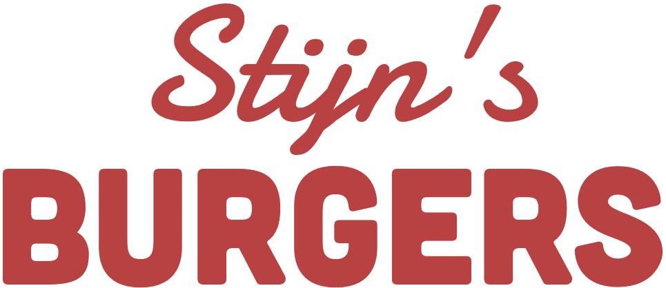
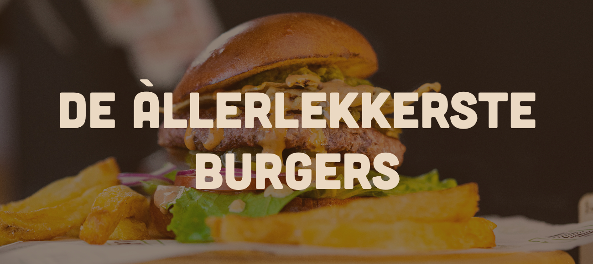
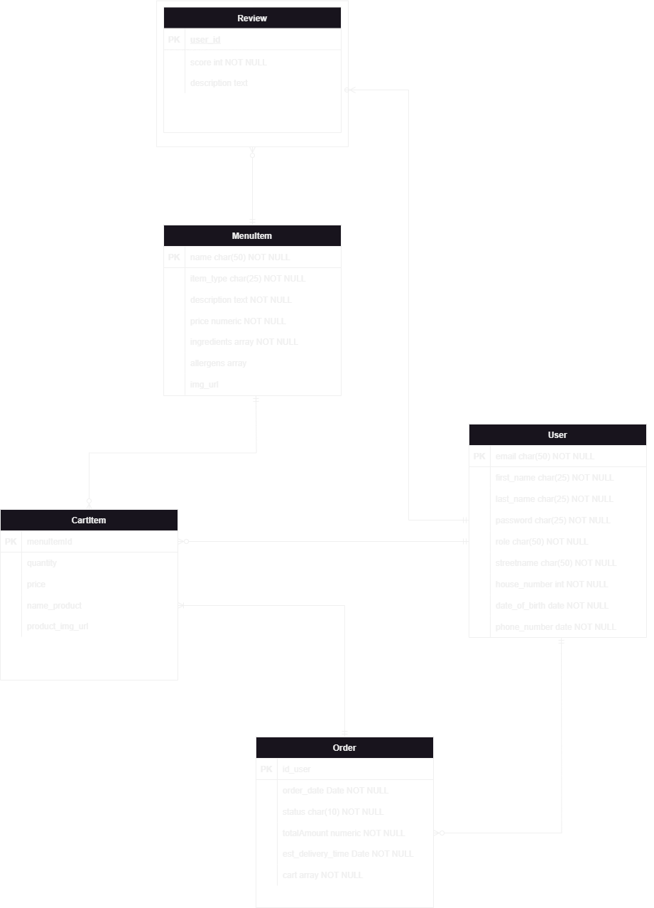

<div align="center">
  

  # Stijn's Burgers

  ### Full-Stack Web Application for Online Burger Ordering

  [](https://angular.io/)
  [](https://www.typescriptlang.org/)
  [](https://nestjs.com/)
  [](https://www.mongodb.com/)
  [](https://getbootstrap.com/)
  [](https://nx.dev/)
  [](https://azure.microsoft.com/)
  [](https://nodejs.org/)
  [](https://jestjs.io/)
  [](LICENSE)

  ---

  **This application was developed by Stijn Robben, a Computer Science student at Avans University of Applied Sciences, as part of the course Client-Side Web Frameworks.**

</div>


## 📖 About the Project

**Stijn's Burgers** is a comprehensive full-stack web application built for online burger ordering. Based in Breda, Netherlands, this platform enables customers to browse an extensive menu of burgers and sides, manage their shopping cart, place orders, and share reviews of their dining experiences.

The project demonstrates modern web development practices, implementing a complete e-commerce solution with user authentication, real-time cart management, admin functionality, and a responsive design that works seamlessly across all devices.

<p align="center">
  
</p>

### 🎯 Project Context

This application was developed as an individual assignment focusing on full-stack JavaScript/TypeScript development. It showcases the integration of contemporary web technologies including:

- **Frontend**: Angular 17 with TypeScript and Bootstrap for a responsive, component-based UI
- **Backend**: NestJS framework providing RESTful APIs
- **Database**: MongoDB NoSQL database for flexible data storage
- **Architecture**: NX monorepo structure for efficient code organization and reusability
- **Deployment**: Azure cloud hosting for production environment


## ✨ Key Features

### 👤 User Management & Authentication
- **🔐 Secure Registration & Login**: JWT-based authentication system with encrypted password storage using bcrypt
- **📝 User Profiles**: Personalized profile pages displaying user information, order history, and review activity
- **🎭 Role-Based Access Control (RBAC)**: Differentiated permissions for customers and administrators with protected routes
- **🔄 Account Management**: Complete CRUD operations - users can update their profiles, change passwords, and delete accounts
- **🛡️ Session Management**: Secure token-based authentication with automatic session expiration and refresh mechanisms
- **📧 Email Validation**: Ensures valid email addresses during registration

### 🍔 Menu System & Product Management
- **📋 Dynamic Product Catalog**: Browse comprehensive menu with burgers, sides, and drinks with high-quality images
- **🔍 Product Details Pages**: Individual pages for each menu item showcasing:
  - Detailed descriptions and ingredients
  - Nutritional information
  - Price and availability status
  - Customer reviews and ratings with star system
  - Related product recommendations
- **⭐ Advanced Review System**:
  - Customers can rate (1-5 stars) and review products they've ordered
  - Review moderation capabilities for admins
  - Helpful/unhelpful voting on reviews
  - Filter and sort reviews by rating, date, or helpfulness
- **🎨 Admin Product Management**:
  - Create new menu items with image uploads
  - Update existing products (price, description, availability)
  - Soft delete products (archived but not removed from history)
  - Bulk operations for managing multiple products

### 🛒 Shopping Experience & Cart Management
- **🛍️ Real-Time Shopping Cart**:
  - Add items with customization options
  - Live price calculation with tax and delivery fees
  - Persistent cart across sessions (saved in local storage)
  - Quick view of cart contents in navigation
- **🔢 Quantity Control**: Adjust quantities with increment/decrement buttons and direct input
- **💾 Save for Later**: Move items between cart and saved list
- **💰 Discount & Promo Codes**: Apply promotional codes at checkout
- **📦 Order Processing**:
  - Multi-step checkout with progress indicator
  - Delivery address management
  - Order notes and special instructions
  - Order confirmation emails
- **📜 Order History**:
  - View all past orders with detailed information
  - Reorder functionality for convenience
  - Order status tracking (Pending, Preparing, Out for Delivery, Delivered)
  - Download order receipts as PDF

### 👨‍💼 Administrative Dashboard
- **📊 Order Management Dashboard**:
  - Real-time order monitoring with status updates
  - Filter orders by status, date, customer
  - Update order status and add internal notes
  - View detailed order information including customer details
  - Export orders for reporting and analytics
- **🍕 Product Management Panel**:
  - Full CRUD capabilities with intuitive interface
  - Image upload and management
  - Inventory tracking and low-stock alerts
  - Category management (Burgers, Sides, Drinks, Desserts)
- **👥 User Management System**:
  - View all registered users
  - Modify user roles (Customer/Admin)
  - Account suspension/reactivation
  - View user activity and order statistics

### 🛡️ Security & Data Protection
- **🔒 JWT Authentication**: Secure token-based authentication with HttpOnly cookies
- **🔐 Password Security**: Bcrypt hashing with salt for password encryption
- **🚫 Route Protection**: Frontend and backend route guards preventing unauthorized access
- **✅ Input Validation**: Comprehensive validation using class-validator and DTOs
- **🛡️ SQL Injection Prevention**: Parameterized queries and MongoDB sanitization
- **🔰 XSS Protection**: Input sanitization and Content Security Policy headers
- **🔑 CORS Configuration**: Secure cross-origin resource sharing settings
- **📝 Audit Logging**: Track important user actions and admin operations

### 🎨 User Interface & Experience
- **📱 Fully Responsive Design**:
  - Mobile-first approach with breakpoints for all device sizes
  - Touch-friendly controls for mobile users
  - Optimized navigation for small screens
- **⚡ Performance Optimization**:
  - Lazy loading for images and routes
  - Code splitting for faster initial load
  - Caching strategies for improved performance
- **♿ Accessibility Features**:
  - ARIA labels and semantic HTML
  - Keyboard navigation support
  - Screen reader compatibility
  - High contrast mode support
- **🌐 Internationalization Ready**: Structure supports multiple languages (i18n)
- **🎭 Animations & Transitions**: Smooth animations for improved user experience
- **🔔 Real-Time Notifications**: Toast notifications for user actions and system updates

### 📡 API & Integration Features
- **🌐 RESTful API Design**:
  - Well-structured endpoints following REST principles
  - Consistent response formats
  - Proper HTTP status codes
  - HATEOAS links for resource discovery
- **📚 Interactive API Documentation**: Swagger/OpenAPI documentation with try-it-out functionality
- **🔄 Pagination & Filtering**: Efficient data loading with pagination, sorting, and filtering
- **🔍 Search Functionality**: Full-text search across menu items
- **📊 Analytics Integration**: Track user behavior and popular products
- **🤖 Recommendation Engine**: Personalized product recommendations based on order history

### 🧪 Testing & Quality Assurance
- **✅ Unit Testing**: Comprehensive test coverage using Jest for both frontend and backend
- **🔬 Integration Testing**: API endpoint testing with supertest
- **🎯 E2E Testing**: End-to-end tests using Cypress for critical user flows
- **📊 Code Coverage**: Maintained test coverage above 80%
- **🔍 Linting & Code Quality**: ESLint and Prettier for consistent code style

---

## 🛠️ Technology Stack

### 🎨 Frontend
- **Framework**: Angular 17 🅰️
- **Language**: TypeScript 5.4 📘
- **Styling**: Bootstrap 5.3, Custom CSS 💅
- **State Management**: RxJS 7.8 🔄
- **HTTP Client**: Angular HttpClient with Axios 🌐
- **UI Components**: Angular Material 🎨

### ⚙️ Backend
- **Framework**: NestJS 10 🐈
- **Language**: TypeScript 5.4 📘
- **Database ODM**: Mongoose 8.2 🍃
- **Authentication**: JWT (@nestjs/jwt) 🔐
- **Validation**: class-validator, class-transformer ✅
- **API Documentation**: Swagger (@nestjs/swagger) 📚

### 💾 Database
- **Primary Database**: MongoDB 6.5 🍃
- **Data Format**: JSON documents with flexible schemas 📄

### 🧰 Development Tools
- **Monorepo Management**: NX 18.2 🔧
- **Build Tool**: Webpack 📦
- **Linting**: ESLint with TypeScript support 🔍
- **Testing**: Jest (unit), Cypress (e2e) 🧪
- **Version Control**: Git 📝
- **CI/CD**: GitHub Actions 🚀

### ☁️ Deployment
- **Cloud Platform**: Microsoft Azure ☁️
- **Server**: Node.js with Express 🟢

---

## 🏗️ Architecture

### 🎯 System Architecture

The application follows a modern three-tier architecture:

1. **🖥️ Presentation Layer**: Angular SPA with component-based architecture
2. **⚙️ Business Logic Layer**: NestJS microservices architecture
   - `data-api`: Main API for business logic and data operations 📊
   - `rcmnd-api`: Recommendation service for personalized suggestions 🤖
3. **💾 Data Layer**: MongoDB with Mongoose ODM

### 📊 Data Model

<p align="center">
  
</p>

The application uses the following main entities:

- **👤 User**: Customer accounts with authentication credentials
- **🍔 MenuItem**: Products (burgers and sides) available for order
- **📦 Order**: Customer orders with order items
- **⭐ Review**: Customer reviews and ratings for menu items
- **🛒 CartItem**: Shopping cart items (client-side state management)

### 🎨 Design Patterns

- **🏛️ MVC Pattern**: Separation of concerns in both frontend and backend
- **📚 Repository Pattern**: Data access abstraction through services
- **💉 Dependency Injection**: Used extensively in NestJS and Angular
- **👁️ Observer Pattern**: RxJS observables for reactive programming
- **🛡️ Guard Pattern**: Route guards for authentication and authorization
- **🎭 Decorator Pattern**: NestJS decorators for routes, validation, and metadata

---

## 📁 Project Structure

```
stijns-burgers/
├── apps/
│   ├── stijns-burgers-web/          # Angular frontend application
│   │   ├── src/
│   │   │   ├── app/                 # App component and routing
│   │   │   └── assets/              # Static assets (images, etc.)
│   ├── stijns-burgers-web-e2e/      # E2E tests for frontend
│   ├── data-api/                    # Main NestJS backend API
│   │   └── src/
│   │       ├── app/                 # API controllers and services
│   │       └── main.ts              # Application entry point
│   ├── data-api-e2e/                # E2E tests for data API
│   ├── rcmnd-api/                   # Recommendation microservice
│   └── rcmnd-api-e2e/               # E2E tests for recommendation API
├── libs/
│   ├── backend/
│   │   ├── dto/                     # Data Transfer Objects
│   │   └── features/                # Backend feature modules
│   │       ├── auth/                # Authentication & authorization
│   │       ├── menu-item/           # Menu item management
│   │       └── user/                # User management
│   ├── shared/
│   │   ├── api/                     # Shared API interfaces
│   │   └── util-env/                # Environment utilities
│   └── stijns-burgers/
│       ├── auth/                    # Frontend auth components
│       ├── common/                  # Common utilities
│       ├── features/                # Feature modules
│       │   ├── homepage/            # Home page
│       │   ├── menu-item/           # Menu components
│       │   ├── cart/                # Shopping cart
│       │   └── orders/              # Order management
│       └── ui/                      # Shared UI components
│           ├── header/              # Navigation header
│           └── footer/              # Page footer
├── nx.json                          # NX workspace configuration
├── package.json                     # Dependencies and scripts
└── tsconfig.base.json               # TypeScript configuration
```

---

## 🚀 Getting Started

### 📋 Prerequisites

Before running this application, ensure you have the following installed:

- **Node.js**: Version 18.x or higher
- **npm**: Version 9.x or higher
- **MongoDB**: Version 6.x or higher (local or cloud instance)
- **Git**: For cloning the repository

### 💻 Installation

1. **📥 Clone the repository**:
   ```bash
   git clone https://github.com/stijn-robben/stijns-burgers.git
   ```

2. **📂 Navigate to the project directory**:
   ```bash
   cd stijns-burgers
   ```

3. **📦 Install dependencies**:
   ```bash
   npm install
   ```

4. **⚙️ Configure environment variables**:

   Create environment configuration files for development:

   - Set up MongoDB connection string
   - Configure JWT secret keys
   - Set API endpoints

### ▶️ Running the Application

#### 🔧 Development Mode

**🚀 Run all applications simultaneously**:
```bash
nx run-many --target=serve --all
```

**🎯 Run specific applications**:

- **🎨 Frontend only**:
  ```bash
  nx serve stijns-burgers-web
  ```
  Access at: `http://localhost:4200`

- **⚙️ Data API only**:
  ```bash
  nx serve data-api
  ```
  Access at: `http://localhost:3000`

- **🤖 Recommendation API only**:
  ```bash
  nx serve rcmnd-api
  ```
  Access at: `http://localhost:3001`

#### 📦 Production Build

**🏗️ Build all applications**:
```bash
nx run-many --target=build --all
```

**🎯 Build specific application**:
```bash
nx build stijns-burgers-web --configuration=production
```

---

## 📚 API Documentation

The backend APIs are documented using Swagger/OpenAPI. When running the application in development mode, you can access the interactive API documentation:

- **Data API Swagger**: `http://localhost:3000/api`
- **Recommendation API Swagger**: `http://localhost:3001/api`

### 🔗 Main API Endpoints

#### 🔐 Authentication
- `POST /api/auth/register` - Register new user
- `POST /api/auth/login` - User login
- `GET /api/auth/profile` - Get current user profile

#### 🍔 Menu Items
- `GET /api/menu-items` - Get all menu items
- `GET /api/menu-items/:id` - Get specific menu item
- `POST /api/menu-items` - Create new menu item (Admin)
- `PUT /api/menu-items/:id` - Update menu item (Admin)
- `DELETE /api/menu-items/:id` - Delete menu item (Admin)

#### 📦 Orders
- `GET /api/orders` - Get all orders (Admin) or user's orders
- `GET /api/orders/:id` - Get specific order
- `POST /api/orders` - Create new order
- `PUT /api/orders/:id` - Update order status (Admin)

#### ⭐ Reviews
- `GET /api/reviews` - Get all reviews
- `GET /api/reviews/menu-item/:id` - Get reviews for menu item
- `POST /api/reviews` - Create new review
- `DELETE /api/reviews/:id` - Delete review (Author or Admin)

---

## 🧪 Testing

### ✅ Unit Tests

Run unit tests for all projects:
```bash
npm test
```

Run tests for specific project:
```bash
nx test stijns-burgers-web
nx test data-api
```

Run tests with coverage:
```bash
nx test --coverage
```

### 🎯 End-to-End Tests

Run E2E tests:
```bash
nx e2e stijns-burgers-web-e2e
nx e2e data-api-e2e
```

Open Cypress test runner:
```bash
nx open-cypress stijns-burgers-web-e2e
```

### 📊 Test Structure

- **✅ Unit Tests**: Jest framework with Angular and NestJS testing utilities
- **🎯 E2E Tests**: Cypress for frontend integration testing
- **🔬 API Tests**: Jest for backend API endpoint testing

---

## ☁️ Deployment

The application is deployed on Microsoft Azure with the following setup:

### 🌐 Production Environment

- **🎨 Frontend**: Azure Static Web Apps or App Service
- **⚙️ Backend APIs**: Azure App Service with Node.js runtime
- **💾 Database**: MongoDB Atlas (cloud-hosted MongoDB)
- **🚀 CI/CD**: GitHub Actions workflow for automated deployment

### ⚙️ Deployment Configuration

The project includes a GitHub Actions workflow (`.github/workflows/main.yml`) that automates:

1. Running tests on pull requests
2. Building production artifacts
3. Deploying to Azure on merge to main branch

### 🔑 Environment Variables

Production environment requires:
- `MONGODB_URI`: MongoDB connection string
- `JWT_SECRET`: Secret key for JWT token generation
- `JWT_EXPIRATION`: Token expiration time
- `API_URL`: Backend API URL
- `RCMND_API_URL`: Recommendation API URL

---

## 🎓 Learning Outcomes

Through the development of this project, the following learning outcomes were achieved:

### 1. **💻 Full-Stack JavaScript/TypeScript Development**
- Gained proficiency in developing both frontend and backend using TypeScript
- Implemented end-to-end type safety across the entire application stack
- Mastered modern ES6+ features and TypeScript advanced types

### 2. **🅰️ Frontend Development with Angular**
- Developed single-page application using Angular 17 with standalone components
- Implemented reactive programming patterns using RxJS observables
- Created reusable components following Angular best practices
- Managed application state and component communication
- Implemented routing with guards for authentication and authorization
- Applied responsive design principles with Bootstrap and custom CSS

### 3. **🐈 Backend Development with NestJS**
- Built RESTful APIs following industry standards
- Implemented authentication and authorization using JWT
- Created modular, scalable backend architecture using NestJS modules
- Applied dependency injection and inversion of control principles
- Implemented data validation and transformation using DTOs
- Integrated API documentation with Swagger/OpenAPI

### 4. **💾 Database Design and Management**
- Designed NoSQL database schema for MongoDB
- Implemented data models using Mongoose ODM
- Created relationships between entities (One-to-Many, Many-to-Many)
- Optimized queries for performance
- Handled data validation at database level

### 5. **🔧 Monorepo Architecture with NX**
- Organized large-scale application using NX workspace
- Created shared libraries for code reusability
- Managed multiple applications within single repository
- Implemented consistent build and test configurations
- Utilized NX's dependency graph for optimized builds

### 6. **🔒 Security Best Practices**
- Implemented JWT-based authentication system
- Applied role-based access control (RBAC)
- Secured API endpoints with guards
- Implemented password hashing using bcrypt
- Protected against common vulnerabilities (XSS, CSRF, SQL Injection)
- Validated and sanitized user inputs

### 7. **🧪 Testing and Quality Assurance**
- Wrote unit tests using Jest framework
- Implemented E2E tests with Cypress
- Applied test-driven development (TDD) principles
- Achieved code coverage targets
- Implemented integration testing for APIs

### 8. **🚀 DevOps and Deployment**
- Set up CI/CD pipeline using GitHub Actions
- Deployed application to Azure cloud platform
- Configured production and development environments
- Implemented automated testing in CI pipeline
- Managed environment variables and secrets

### 9. **🌐 API Design and Integration**
- Designed RESTful API following REST principles
- Implemented proper HTTP status codes and error handling
- Created API documentation using Swagger
- Implemented API versioning strategy
- Handled asynchronous operations and promises

### 10. **⚙️ Software Engineering Principles**
- Applied SOLID principles in code architecture
- Implemented design patterns (Repository, Singleton, Observer, etc.)
- Followed DRY (Don't Repeat Yourself) principle
- Maintained separation of concerns
- Created maintainable and scalable code structure
- Utilized version control effectively with Git

### 11. **🎨 User Experience (UX) Design**
- Created intuitive and user-friendly interfaces
- Implemented responsive design for multiple device sizes
- Applied accessibility standards (WCAG)
- Designed smooth user flows for common tasks
- Provided clear feedback for user actions

### 12. **🔍 Problem-Solving and Debugging**
- Debugged complex full-stack issues
- Implemented comprehensive error handling
- Used browser and Node.js debugging tools
- Analyzed and optimized application performance
- Resolved dependency conflicts in large projects


<br>
<br>
<br>


<p align="center">
  
</p>


